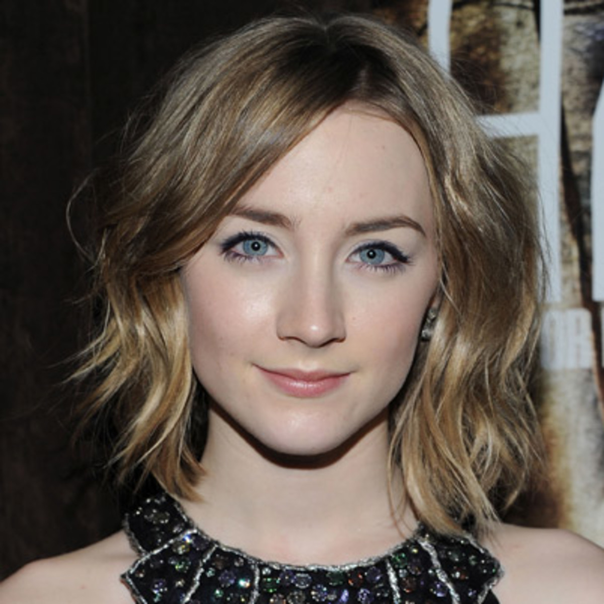

# OpenScout: Distributed Automated Situational Awareness

OpenScout utilizes Gabriel, a platform originally designed for wearable cognitive assistance applications, to stream image data to the backend server which runs several cognitive engines to evaluate each image. Currently we support object detection via Tensorflow and face recognition via OpenFace. We also support Microsoft Face Cognitive Service if you have an Azure account and have setup the cognitive service endpoint.

Copyright &copy; 2020
Carnegie Mellon University

This is a developing project.

## License

Unless otherwise stated in the table below, all source code and documentation are under the [Apache License, Version 2.0](http://www.apache.org/licenses/LICENSE-2.0.html).
A copy of this license is reproduced in the [LICENSE](LICENSE) file.

Portions from the following third party sources have
been modified and are included in this repository.
These portions are noted in the source files and are
copyright their respective authors with
the licenses listed.

Project | Modified | License
---|---|---|
[cmusatyalab/openface](https://github.com/cmusatyalab/openface) | Yes | Apache 2.0

## Prerequisites

OpenScout uses Tensorflow for object detection and OpenFace for face detection/recognition. It has been tested on __Ubuntu 16.04 LTS (Xenial)__ and __Ubuntu 18.04 LTS (Bionic)__. The object detection cognitive engine requires an nVidia GPU.

If you wish to use [Microsoft's Face Cognitive Service](https://docs.microsoft.com/en-us/azure/cognitive-services/face/face-how-to-install-containers) for face recognition, you will need to have an Azure account and setup the endpoint and API keys as described in the the above link. You will also need to reconfigure the docker-compose.yaml file. See the Launching Server section for more details.

OpenScout has an Android client that is available on the [Google PlayStore](https://play.google.com/store/apps/details?id=edu.cmu.cs.openscout). It requires an Android device running Android 7.0+ (API level 24).

## Server Installation using Docker

The quickest way to set up an OpenScout server is to download and run our pre-built Docker container.  This build supports execution on NVIDIA GPUs, Intel integrated GPUs, and execution on the CPU. All of the following steps must be executed as root. We tested these steps using Docker 19.03.

### 1. Install Docker and docker-compose

If you do not already have Docker installed, install it using the steps in this [Docker install guide](https://docs.docker.com/engine/installation/linux/docker-ce/ubuntu/) or use the following convenience script:

```sh
curl -fsSL get.docker.com -o get-docker.sh
sh get-docker.sh
```

Install [docker-compose](https://docs.docker.com/compose/install/).

### 2. Ensure an NVIDIA driver is installed

[These notes](https://github.com/NVIDIA/nvidia-docker/wiki/Frequently-Asked-Questions#how-do-i-install-the-nvidia-driver) explain how to install the driver.

If you think you may already have an NVIDIA driver installed, run `nvidia-smi`. The Driver version will be listed at the top of the table that gets printed.

### 3. Install the [NVIDIA Container Toolkit](https://github.com/NVIDIA/nvidia-docker)

Follow [these instructions](https://github.com/NVIDIA/nvidia-docker#ubuntu-16041804-debian-jessiestretchbuster).

After installing the toolkit, ensure that the Docker daemon is prepared to use it by adding the following to `/etc/docker/daemon.json`:

```json
{
    "runtimes": {
        "nvidia": {
            "path": "/usr/bin/nvidia-container-runtime",
            "runtimeArgs": []
        }
    }
}
```

### 4. Obtain OpenScout/OpenFace Docker images

```sh
docker pull cmusatyalab/openscout:stable
docker pull cmusatyalab/openface:latest
```

### 5. Configure the environment for OpenScout

In the `~/openscout/server/` directory, there is a template.env file that can be used as an example docker-compose environment. Copy it to .env and then modify it to control things such as the confidence thresholds for the face and object engines. If you are using the MS Face Cognitive Service, the API key and endpoint would also be specified here.

```sh
cd ~/openscout/server/
cp template.env .env
#edit .env file as necessary
```

### 5. Launch the Docker containers with docker-compose

To launch all the containers and interleave the output from each container in the terminal:

```sh
cd ~/openscout/server
docker-compose up
```

If you wish to launch the containers in the background, you can pass the -d flag to docker compose. You can then use docker logs to inspect what is happening to individual containers.

```sh
cd ~/openscout/server
docker-compose up -d
```

If you wish to use the Microsoft Face Cognitive Service instead of OpenFace, the docker-compose.yaml file will need to be [modified](https://github.com/cmusatyalab/openscout/blob/7bda45e3ab494042fe3909f8f8620ac844d1ce79/server/docker-compose.yml#L69) to comment out the openface-service and instead use ms-face-service.

## Android Client Installation

You can download the client from the [Google Play Store](https://play.google.com/store/apps/details?id=edu.cmu.cs.openscout).

Alternatively, you can build the client yourself using [Android Studio](https://developer.android.com/studio). The source code for the client is located in the `android-client` directory. You should use the standardDebug [build variant](https://developer.android.com/studio/run#changing-variant).

### Managing Servers

Servers can be added by entering a server name and address and pressing the + sign button. Once a server has been added, pressing the 'Connect' button will connect to the OpenScout server at that address. Pressing the trash can button will remove the server from the server list.

### Settings

#### General

* Show Screenshot/Recording Buttons - This will enable icons to allow you to capture video or screenshots while running OpenScout.
* Display Metrics - Enabling this option will show the number of detections during your sessions.
#### Experimental

* Resolution - Configure the resoultion to capture at. This will have a moderate impact in the computation time on the server.
* Gabriel Token Limit - Allows configuration of the token-based flow control mechanism in the Gabriel platform. This indicates how many frames can be in flight before a response frame is received back from the server. The minimum of the token limit specified in the app and the number of tokens specified on the server will be used.

### Front-facing Camera

Once connected to a server, an icon is displayed in the upper right hand corner which allows one to toggle between front- and rear-facing cameras.

### Ad hoc Training

The add person button can be clicked to train a person for facial recognition on the fly. Enter the name you wish the person to be identified as and then click the 'Train' button. The images captured over the next 5 seconds will be used as the training set. Ensure that the persons face is prominently displayed in the catpured images.


## Object Detection

For object detection, we have prepackaged the [ssd_resnet_50_fpn_coco](http://download.tensorflow.org/models/object_detection/ssd_mobilenet_v1_fpn_shared_box_predictor_640x640_coco14_sync_2018_07_03.tar.gz) DNN from the [Tensorflow Detection Model Zoo](https://github.com/tensorflow/models/blob/master/research/object_detection/g3doc/tf1_detection_zoo.md#coco-trained-models). The COCO dataset has ~100 objects that it will detect. The dataset and the objects in it can be explored [here](https://cocodataset.org/#explore).

OpenScout's object detection cognitive engine also supports Tensorflow DNNs exported out of [OpenTPOD](https://github.com/cmusatyalab/opentpod).

## Face Recognition

Out of the box, we have trained on three celebrities' faces: Dwayne Johnson, Saoirse Ronan, and Hugh Jackman. Ten images for each person can be found in the `/openscout/server/training` directory. You can create subdirectories at this location for additional people and then rebuild the Docker image so that they will be included at startup. You may also train ad hoc as described above in the Android client section. Test images for the three celebrities can be found below.

Dwayne Johnson  |  Saoirse Ronan  | Hugh Jackman
:--------------:|:---------------:|:---------------:
  |   |  

## Credits

Please see the [CREDITS](CREDITS.md) file for a list of acknowledgments.
